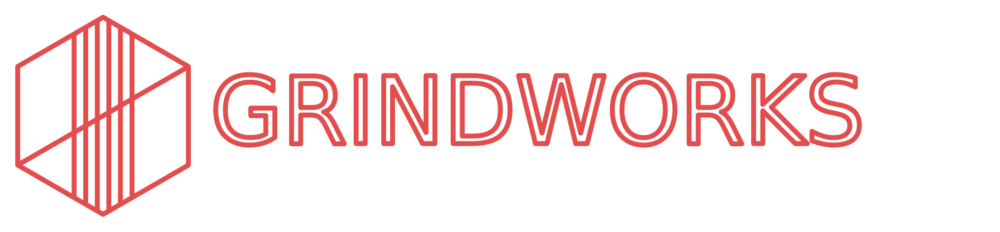

<div align="center">

  



</div>

# Grindworks

Grindworks is a cross-platform application written in Javascript using the **Quasar** framework and the **Electron.js** library to generate characters for the **Degenesis** roleplaying game.

Degenesis® is ™ SIXMOREVODKA Studio GmbH. All rights reserved. This app contains information and graphics from **Primal Punk**, **Katharsys** and **Artifacts** that have been used with permission from the publisher. All used content from the handbook belong to the respective authors.

## Install

> Application is in early stage of development and there are no binaries avaiable at this point. Usability is very limited and only people interested in development should install current build.

### Clone repository using HTTPS file:

```bash
https://github.com/greedyj4ck/grindworks.git
```

### or Github CLI:

```bash
gh repo clone greedyj4ck/grindworks
```

### Install dependencies:

```bash
npm install
```

## Running hot reload development mode

```bash
npm run dev
```

## Support

For support, hop on **Court of The Piast** Discord server: https://discord.gg/MC6gEVvnzm
